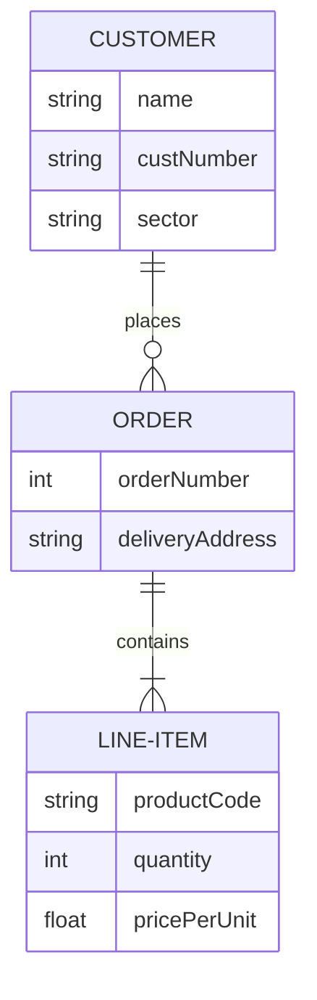
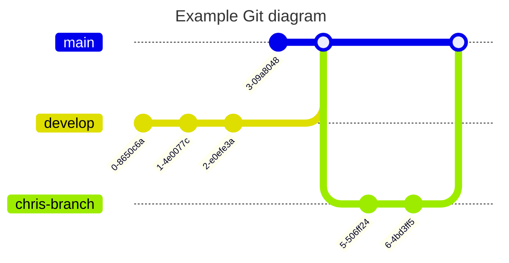
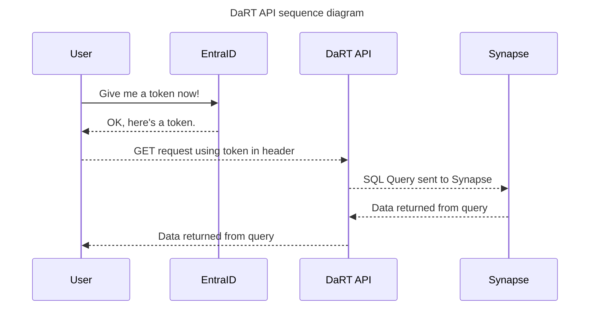
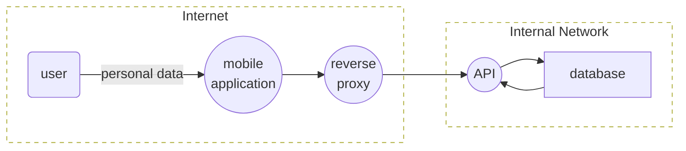
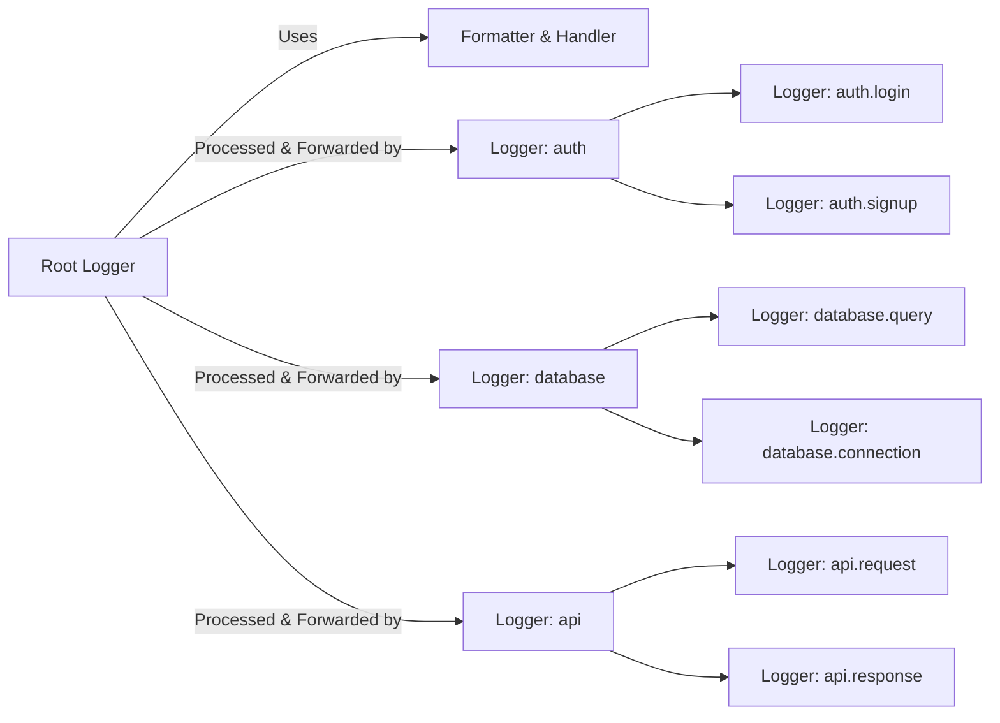

# This is a mermaid diagram  

```mermaid

erDiagram
    CUSTOMER ||--o{ ORDER : places
    CUSTOMER {
        string name
        string custNumber
        string sector
    }
    ORDER ||--|{ LINE-ITEM : contains
    ORDER {
        int orderNumber
        string deliveryAddress
    }
    LINE-ITEM {
        string productCode
        int quantity
        float pricePerUnit
    }

```

```mermaid

---
title: Example Git diagram
---
gitGraph

branch develop
commit
commit
commit
checkout main
commit
merge develop
branch chris-branch
commit
commit
checkout main
merge chris-branch
```
#### And now a sequence diagram

```mermaid

---
title: DaRT API sequence diagram
---
sequenceDiagram
    User ->> EntraID: Give me a token now!
    EntraID-->>User: OK, here's a token.
    User-->> DaRT API: GET request using token in header
    DaRT API -->> Synapse: SQL Query sent to Synapse
    Synapse -->> DaRT API: Data returned from query
    DaRT API -->> User: Data returned from query
```

#### Data Flow example  

```mermaid
flowchart LR
    user(user)
    mobile((mobile\napplication))
    proxy((reverse\nproxy))
    api((API))
    db[|borders:tb|database]

    subgraph external [Internet]
        user--personal data-->mobile
        mobile-->proxy
    end
    subgraph dmz [Internal Network]
        proxy-->api
        db-->api
        api-->db
    end
    classDef boundary fill:none,stroke-dasharray: 5 5
    dmz:::boundary
    external:::boundary
```
#### Logging example

```mermaid
flowchart LR
    A[Root Logger] -->|Uses| K[Formatter & Handler]

    A-->|Processed & Forwarded by| B[Logger: auth]
    A -->|Processed & Forwarded by| C[Logger: database]
    A -->|Processed & Forwarded by| D[Logger: api]

    B --> E[Logger: auth.login]
    B --> F[Logger: auth.signup]

    C --> G[Logger: database.query]
    C --> H[Logger: database.connection]

    D --> I[Logger: api.request]
    D --> J[Logger: api.response]

    classDef logger fill;
    classDef formatter fill;
    classDef handler fill;
    class A,B,C,D,E,F,G,H,I,J logger;
    class K handler;
```